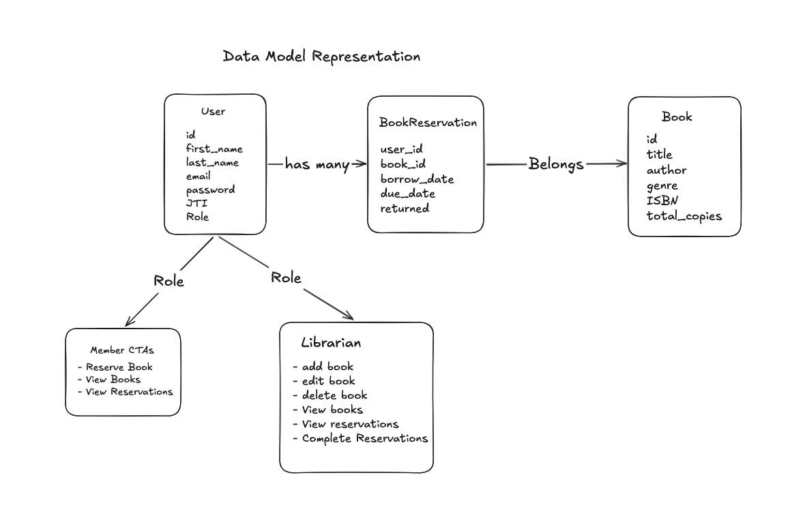
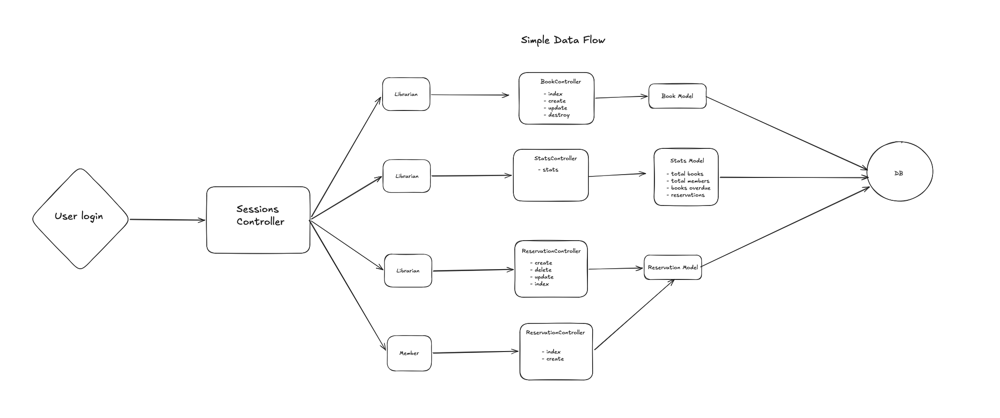

# Summary

This is a basic Library Management tool, there are two main roles

- Librarian: This role is in charge of Add, Remove, Update books and reservations
- Member: This role can create reservations and view books available

## Tech Stack

For this assessment, the following technologies were used:

1. Ruby on Rails as the Backend stack
   a. Devise for JWT authentication
   b. Pundit for authorization policies
   c. RESTful JSON API responses
2. React + Vite + StyledComponents as the Frontend stack
   a. AXIOS for AJAX calls
   b. React Router to map application routes
3. Database will be Postgres
4. Claude + Skills as AI generative tools

## Data Model



## Funnel



## Demo Credentials

**Important** These are por demo purposes

| Role      | Email                 | Password    |
| --------- | --------------------- | ----------- |
| Librarian | librarian@example.com | password123 |
| Member    | member@example.com    | password123 |
| Member2   | member2@example.com   | password123 |

## GenAI Tools

This project was built using Claude as the primary AI coding assistant,
with Claude Code for file-level generation.

### Approach

- `CLAUDE.md` files defined project conventions for both backend and frontend
- Custom skills were created for git commits, pull requests, Rails expert and React frontend expert
- Claude generated boilerplate; all output was reviewed and corrected before committing

### Example Prompt (Books CRUD)

```
Following CLAUDE.md conventions, create a full CRUD for the Book resource.

BooksController under Api::V1 with index (search by title/author/genre), show, create, update, destroy. Librarian only for write actions via Pundit.

BookSerializer using jsonapi-serializer. Request specs for all actions.
```

### What Was Validated

- Authorization enforced on every action
- No raw SQL — all queries through ActiveRecord scopes
- Specs cover both happy path and edge cases
- Idiomatic Ruby — params.expect, thin controllers, service objects
- React best practices and good patterns

## User Story

As a **Member**, I want to browse available books and reserve them
so that I can track what I'm reading and when books are due back.

As a **Librarian**, I want to manage the book catalogue and track
reservations so that I can keep the library organised and follow
up on overdue books.

## API Endpoints

### Auth

| Method | Endpoint              | Description |
| ------ | --------------------- | ----------- |
| POST   | /api/v1/auth/sign_in  | Login       |
| DELETE | /api/v1/auth/sign_out | Logout      |
| POST   | /api/v1/auth/sign_up  | Register    |

### Books

| Method | Endpoint          | Description               |
| ------ | ----------------- | ------------------------- |
| GET    | /api/v1/books     | List all books            |
| POST   | /api/v1/books     | Create a book (librarian) |
| PUT    | /api/v1/books/:id | Update a book (librarian) |
| DELETE | /api/v1/books/:id | Delete a book (librarian) |

### Reservations

| Method | Endpoint                      | Description               |
| ------ | ----------------------------- | ------------------------- |
| POST   | /api/v1/borrowings            | Borrow a book (member)    |
| PATCH  | /api/v1/borrowings/:id/return | Return a book (librarian) |
| GET    | /api/v1/dashboard             | Dashboard data            |

## Known Limitations

- No pagination on book listing endpoint
- Frontend has no unit tests (intentional for scope of assessment)
- Password reset, remeber user login, signup flows were not implemented
- The search mechanism lives currently in the frontend

## Backend Setup

1. [Install ruby and rails](https://guides.rubyonrails.org/v8.0/install_ruby_on_rails.html)

```bash
# Install Xcode Command Line Tools
$ xcode-select --install

# Install Homebrew and dependencies
$ /bin/bash -c "$(curl -fsSL https://raw.githubusercontent.com/Homebrew/install/HEAD/install.sh)"
$ echo 'export PATH="/opt/homebrew/bin:$PATH"' >> ~/.zshrc
$ source ~/.zshrc
$ brew install openssl@3 libyaml gmp rust

# Install Mise version manager
$ curl https://mise.run | sh
$ echo 'eval "$(~/.local/bin/mise activate)"' >> ~/.zshrc
$ source ~/.zshrc

# Install Ruby globally with Mise
$ mise use -g ruby@3
```

2. To setup the BE use

```bash
cd backend && bundle install
```

3. Install Github CLI

```bash
brew install gh
gh auth login
```

4. Install postgres

```bash
# Install
brew install postgresql@16
brew services start postgresql@16

# Reload your zsh
export PATH="/opt/homebrew/opt/postgresql@16/bin:$PATH"
source ~/.zshrc

# Verify
psql --version
psql postgres
```

5. Set up your DB

```bash
bundle exec rails db:create
bundle exec rails db:migrate
bundle exec rails db:seed
```

6. Start the backend server

```bash
# in the backend folder run
bundle exec rails s
```

## Frontend Setup

1. [Install Node.js](https://nodejs.org/en/download/)

```bash
# Download and install nvm:
curl -o- https://raw.githubusercontent.com/nvm-sh/nvm/v0.40.4/install.sh | bash

# in lieu of restarting the shell
\. "$HOME/.nvm/nvm.sh"

# Download and install Node.js:
nvm install 24

# Verify the Node.js version:
node -v # Should print "v24.14.0".

# Verify npm version:
npm -v # Should print "11.9.0".
```

2. Install dependencies

```bash
npm install
```

3. Run the project

```bash
# In the frontend folder run the following
npm run dev
```
